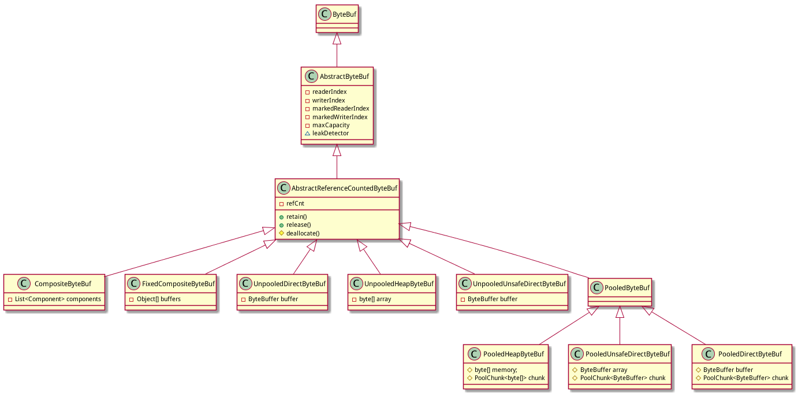
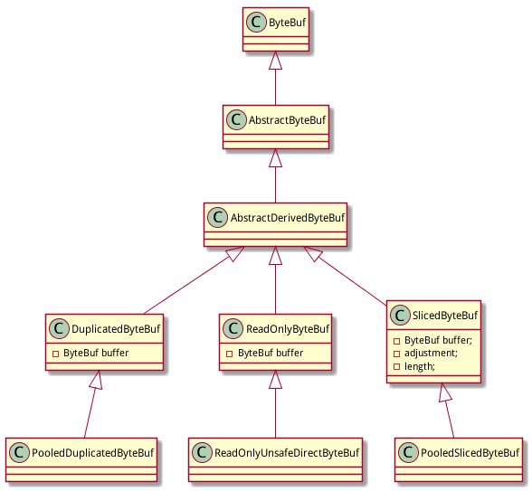
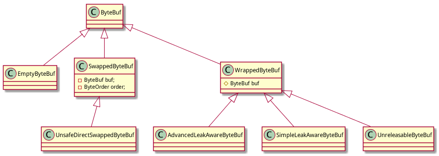

# 继承结构

## ByteBuf全景图

ByteBuf实现类众多,继承层级复杂:

第一眼看上去比较乱,拆分为三个大块后就容易理解:

- ByteBuf基础实现类: ByteBuf的基本实现
- ByteBuf衍生类: 基于Basic ByteBuf衍生的ByteBuf
- 特殊的ByteBuf类: 一些比较特殊的ByteBuf实现

## ByteBuf基础实现类

ByteBuf的基础实现类，按照内存分配方式不同分为：

- HeapByteBuf: 直接使用java堆内存
- DirectByteBuf: 使用java nio提供的直接内存, 体现为使用nio ByteBuffer
- UnsafeDirectByteBuf: DirectByteBuf的特殊情况,如果当前系统提供了sun.misc.Unsafe

然后按照是否支持池共享又分为：

- PooledByteBuf
- UnpooledByteBuf

注意: PooledByteBuf是4.x之后的新特性, netty3.*和之前版本不支持的.

去掉干扰之后, 再看ByteBuf的基本实现就很清晰:

1. 首先是ByteBuf/AbstractByteBuf/AbstractReferenceCountedByteBuf搭建起基础

	- ByteBuf: ByteBuf的接口定义
		比较奇怪的是netty的作者选择了不定义为interface,而是abstract class然后没有任何接口定义之外的代码
	- AbstractByteBuf: 提供了readerIndex/writerIndex/maxCapacity等相关的基础功能,实现了一些通用的方法方便基类使用,定义了一些模板方法. 另外定义了leakDetector.
	- AbstractReferenceCountedByteBuf: 为Reference Counted提供了基础实现如refCnt/retain()方法/release()方法,还定义了非常重要的模板方法deallocate()

2. 根据是否支持Pool,区分为Unpooled和Pooled两大阵营

	Unpooled阵营:

        - UnpooledHeapByteBuf: 提供非池化的堆内存支持, 基于byte[]
        - UnpooledDirectByteBuf: 提供非池化的直接内存支持, 基于 NIO ByteBuffer
        - UnpooledUnsafeDirectByteBuf: 提供非池化的直接内存支持,基于 NIO ByteBuffer, **要求sun.misc.Unsafe可用**

	Pooled阵营:

		- PooledByteBuf: Pooled的基类, 提供Pool的基本实现
        - PooledHeapByteBuf: 提供池化的堆内存支持, 基于byte[]
        - PooledUnsafeDirectByteBuf: 提供池化的直接内存支持, 基于 NIO ByteBuffer
        - PooledDirectByteBuf: 提供池化的直接内存支持,基于 NIO ByteBuffer, **要求sun.misc.Unsafe可用**

	设计上,比较奇怪的是没有定义一个UnpooledByteBuf基类,造成两大阵营的结构不对称,看上去不够美观 :)

3. CompositeByteBuf

	在Unpooled和Pooled两大阵营之外, CompositeByteBuf/FixedCompositeByteBuf是一个超然的存在.

    CompositeByteBuf是一个虚拟的buffer,将多个buffer展现为一个简单合并的buffer,以便实现netty最重要的特性之一: zero copy.后面有详细分析.

    FixedCompositeByteBuf功能类似CompositeByteBuf, 以只读的方式包装一个ByteBuf数组,通常用于写入一组ByteBuf的内容.

    注: 从类的功能和实现上看, 感觉CompositeByteBuf更应该归入后面的ByteBuf衍生类.

## ByteBuf衍生类

Derived ByteBuf是在ByteBuf的基本实现基础上衍生出来的: 包装其他ByteBuf,然后增加一些特别的功能.

Derived ByteBuf有抽象类AbstractDerivedByteBuf作为基类.AbstractDerivedByteBuf的javadoc如此描述:

	Abstract base class for ByteBuf implementations that wrap another ByteBuf.

类继承结构如图,主要有:

- DuplicatedByteBuf: 简单的将所有的请求都委托给包装的ByteBuf
- PooledDuplicatedByteBuf: 在DuplicatedByteBuf的基础上提供池的支持
- ReadOnlyByteBuf: 将原有ByteBuf包装为只读的ByteBuf, 所有的写方法都被禁止(抛ReadOnlyBufferException)
- ReadOnlyUnsafeDirectByteBuf: 在ReadOnlyByteBufferBuf的基础上提供对direct ByteBuffer的支持,为了得到最佳性能使用unsafe
- SlicedByteBuf: 将原有ByteBuf的部分内容拆分出来的ByteBuf,主要是为了实现zero-copy特性,后面有详细介绍
- PooledSlicedByteBuf: 在SlicedByteBuf的基础上提供池的支持

## 特殊的ByteBuf类

除了上面介绍的ByteBuf的底层实现类和衍生类之外,netty还提供了3种特殊的ByteBuf:

- EmptyByteBuf: 空的ByteBuf, capacity 和 maximum capacity 都被设置为0.
- SwappedByteBuf: Swap/交换指的是LITTLE_ENDIAN/BIG_ENDIAN之间的交换, SwappedByteBuf用于包装一个ByteBuf,内容相同但是ByteOrder相反.它的子类UnsafeDirectSwappedByteBuf支持memoryAddress.
- WrappedByteBuf: WrappedByteBuf顾名思义是用来包装其他ByteBuf的,代码实现也简单: 包装一个ByteBuf,然后所有方法调用委托给被包装的ByteBuf

WrappedByteBuf的主要作用是作为基类派生出下面几个子类:

- AdvancedLeakAwareByteBuf
- SimpleLeakAwareByteBuf
- UnreleasableByteBuf

AdvancedLeakAwareByteBuf和SimpleLeakAwareByteBuf用于resource leak detect. 具体介绍见[类LeakAwareByteBuf](./class_LeakAwareByteBuf.html).

UnreleasableByteBuf用于阻止其他对ByteBuf的销毁. 具体介绍见[类UnreleasableByteBuf](./class_UnreleasableByteBuf.html).

# 总结

在将所有的ByteBuf类划分为上述3个大块之后, ByteBuf的设计就很清晰了.

后面将通过重点介绍netty提供的几个重要特性来详细展开相关ByteBuf类的具体实现.
