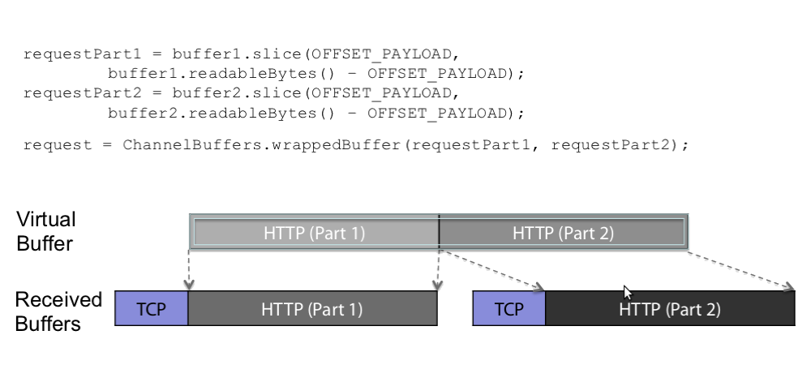

netty中的Zero-copy与传统意义的zero-copy不太一样,注意不要混淆:

- 传统的zero-copy是IO传输过程中，数据无需中内核态到用户态、用户态到内核态的数据拷贝，减少拷贝次数。
- Netty的zero-copy则是完全在用户态，或者说传输层的zero-copy机制，可以参考下图。


在协议传输过程中，通常需要拆包、合并包，常见的做法就是通过System.arrayCopy来复制需要的数据,但这样需要付出内容复制的开销.

Netty通过ByteBuf.slice和Unpooled.wrappedBuffer等方法拆分、合并Buffer,做到无需拷贝数据。

# slice

slice是拆包,在原有包的基础上获取其中部分内容, 为此在ByteBuf中定义有slice()方法.



# wrap

netty提供了一系列的方法,用来将多个数据源包装成一个可以直接使用的ByteBuf对象,以避免内容复制.

这些方法处理的数据类型包括:

- byte[]
- ByteBuf: wraps the specified buffer's readable bytes
- ByteBuffer (java nio)

```java
public static ByteBuf wrappedBuffer(byte[] array) {}
public static ByteBuf wrappedBuffer(byte[] array, int offset, int length) {}
public static ByteBuf wrappedBuffer(ByteBuffer buffer) {}
public static ByteBuf wrappedBuffer(ByteBuf buffer) {}

public static ByteBuf wrappedBuffer(byte[]... arrays) {}
public static ByteBuf wrappedBuffer(ByteBuf... buffers) {}
public static ByteBuf wrappedBuffer(ByteBuffer... buffers) {}

public static ByteBuf wrappedBuffer(int maxNumComponents, byte[]... arrays) {}
public static ByteBuf wrappedBuffer(int maxNumComponents, ByteBuf... buffers) {}
public static ByteBuf wrappedBuffer(int maxNumComponents, ByteBuffer... buffers) {}
```
可以包装一个或者多个数据.