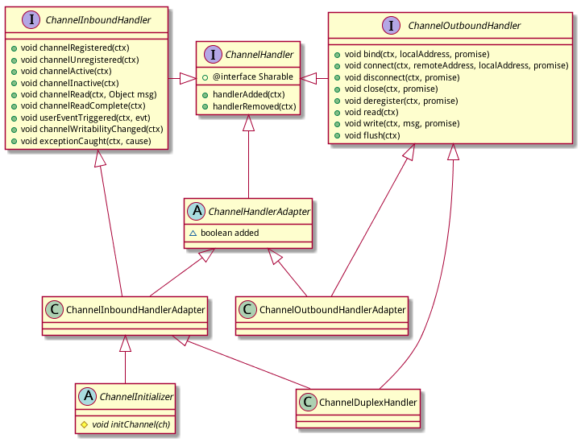

ChannelHandlerAdapter相关类
==========================

为了方便使用, netty提供了几个adapter类, 这些adapter类实现ChannelHandler接口并提供了一些平庸(空)实现, 这样子类可以方便的只覆盖自己关心的方法.

类继承结构如下:



# 类ChannelHandlerAdapter

类定义, ChannelHandlerAdapter实现了ChannelHandler接口:

```java
public abstract class ChannelHandlerAdapter implements ChannelHandler {}
```

handlerAdded()和handlerRemoved()方法都给了一个空实现:

```java
public void handlerAdded(ChannelHandlerContext ctx) throws Exception {
    // NOOP
}
public void handlerRemoved(ChannelHandlerContext ctx) throws Exception {
    // NOOP
}
```

exceptionCaught()方法被delegate给ChannelHandlerContext了:

```java
public void exceptionCaught(ChannelHandlerContext ctx, Throwable cause) throws Exception {
    ctx.fireExceptionCaught(cause);
}
```

此外提供了isSharable()方法来判断当前hanlder是否是可共享(在多个pipeline中,见前文):

```java
public boolean isSharable() {
    Class<?> clazz = getClass();
    Map<Class<?>, Boolean> cache = InternalThreadLocalMap.get().handlerSharableCache();
    Boolean sharable = cache.get(clazz);
    if (sharable == null) {
        sharable = clazz.isAnnotationPresent(Sharable.class);
        cache.put(clazz, sharable);
    }
    return sharable;
}
```

实现时有一个cache用来保存结果.

另外定义了一个added属性:

```java
boolean added;
```

注: 类ChannelHandlerAdapter真没有什么内容, 主要是ChannelHandler接口也够简单.继续看.

# 类ChannelInboundHandlerAdapter

类ChannelInboundHandlerAdapter的定义如下, 继承自ChannelHandlerAdapter, 另外声明实现ChannelInboundHandler接口:

```java
public class ChannelInboundHandlerAdapter extends ChannelHandlerAdapter implements ChannelInboundHandler {}
```

类ChannelInboundHandlerAdapter实现了ChannelInboundHandler接口定义的各个inbound操作方法, 实现方式简单就一个话: **统统delegate给ChannelHandlerContext!** 以channelRegistered()方法为例:

```java
@Override
public void channelRegistered(ChannelHandlerContext ctx) throws Exception {
    ctx.fireChannelRegistered();
}
```

# 类ChannelOutboundHandlerAdapter

类ChannelOutboundHandlerAdapter也是类似, 类定义如下:

```java
public class ChannelOutboundHandlerAdapter extends ChannelHandlerAdapter implements ChannelOutboundHandler {}
```

所有outbound方法也都是同样的delegate给ChannelHandlerContext, 以bind()方法为例:

```java
public void bind(ChannelHandlerContext ctx, SocketAddress localAddress,
        ChannelPromise promise) throws Exception {
    ctx.bind(localAddress, promise);
}
```

# 类ChannelDuplexHandler

类ChannelDuplexHandler同时实现了ChannelInboundHandler和ChannelOutboundHandler:

```java
public class ChannelDuplexHandler extends ChannelInboundHandlerAdapter implements ChannelOutboundHandler {}
```

方式方式也是一样的delegate给ChannelHandlerContext.

# 总结

这三个Adapter类的实现非常简单, 所有方法要不就是空实现, 要不就delegate给ChannelHandlerContext.
