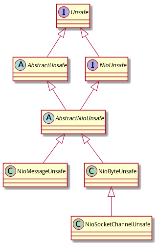

前面谈到在Channel接口内部定义了一个Unsafe接口, 然后有部分方法是直接delagate给unsafe的:

```java
public boolean isWritable() {
    ChannelOutboundBuffer buf = unsafe.outboundBuffer();
    return buf != null && buf.isWritable();
}
```

# Unsafe的概念

Unsafe 是内部接口, 从设计上说这个接口的所有实现都是netty的内部代码,只能被netty自己使用. **netty的使用者时不应该** 直接调用这些内部实现的.

Unsafe的javadoc是这样要求的:

> Unsafe operations that should **never** be called from user-code. These methods are only provided to implement the actual transport, and must be invoked from an I/O thread except for the following methods:

**Unsafe 操作不能被用户代码调用.这些方法仅仅用于实现具体的transport, 而且必须被I/O线程调用.**

以下方法例外(可以在I/O线程之外被调用):

- invoker()
- localAddress()
- remoteAddress()
- closeForcibly()
- register(EventLoop, ChannelPromise)
- deregister(ChannelPromise)
- voidPromise()


# Unsafe 接口定义

## Unsafe定义的方法

Unsafe接口中定义了以下方法:

### 获取特殊属性

- RecvByteBufAllocator.Handle recvBufAllocHandle()
- ChannelHandlerInvoker invoker()
- ChannelOutboundBuffer outboundBuffer()
- ChannelPromise voidPromise()

### 获取网络参数

- SocketAddress localAddress()
- SocketAddress remoteAddress()

### 注册到EventLoop

- void register(EventLoop eventLoop, ChannelPromise promise)
- void deregister(ChannelPromise promise)

### IO操作

- void bind(SocketAddress localAddress, ChannelPromise promise)
- void connect(SocketAddress remoteAddress, SocketAddress localAddress, ChannelPromise promise)
- void disconnect(ChannelPromise promise)
- void close(ChannelPromise promise)
- void closeForcibly()
- void beginRead()
- void write(Object msg, ChannelPromise promise)
- void flush()

# Unsafe的实现

## Unsafe的继承结构

以nio unsafe为例:



## AbstractUnsafe

在AbstractChannel中定义有内部类AbstractUnsafe, 按照javadoc的说明, 所有的Unsafe的实现都必须从AbstractUnsafe继承:

```java
public abstract class AbstractChannel extends DefaultAttributeMap implements Channel {
    /**
     * {@link Unsafe} implementation which sub-classes must extend and use.
     */
    protected abstract class AbstractUnsafe implements Unsafe {
    }
}
```


