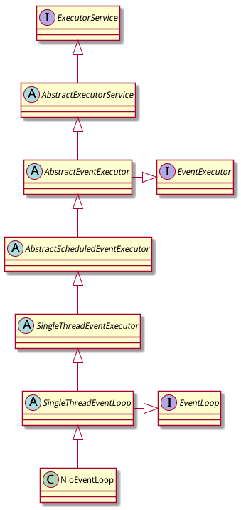

AbstractEventExecutor类的类定义, 继承自AbstractExecutorService, 另外申明实现EventExecutor接口.

```java
public abstract class AbstractEventExecutor extends AbstractExecutorService implements EventExecutor {

}
```

我们将AbstractEventExecutor类的代码分成两部分来看.

# EventExecutor接口实现的代码

下面这些代码是实现EventExecutor接口的基本代码,没有特别之处.

```java
    private final EventExecutorGroup parent;

    protected AbstractEventExecutor() {
        this(null);		// 为什么要容许parent为null?
    }

    protected AbstractEventExecutor(EventExecutorGroup parent) {
        this.parent = parent;
    }

    @Override
    public EventExecutorGroup parent() {
        return parent;
    }

    @Override
    public EventExecutor next() {
    	// EventExecutor的next()方法需要返回自身引用
        return this;
    }

    @Override
    @SuppressWarnings("unchecked")
    public <E extends EventExecutor> Set<E> children() {
    	// EventExecutor的children()方法需要的集合只能包含自身的引用
        return Collections.singleton((E) this);
    }

	...... // 其他代码忽略
```

# ExecutorService接口实现的代码

## 覆盖submit()方法

对ExecutorService接口的实现才是关键代码, 先看三个submit()方法:

```java
@Override
public Future<?> submit(Runnable task) {
    return (Future<?>) super.submit(task);
}

@Override
public <T> Future<T> submit(Runnable task, T result) {
    return (Future<T>) super.submit(task, result);
}

@Override
public <T> Future<T> submit(Callable<T> task) {
    return (Future<T>) super.submit(task);
}
```

这里只做了一件事情,将返回的Future类型从java.util.concurrent.Future覆盖成了netty自己的io.netty.util.concurrent.Future. (注意:io.netty.util.concurrent.Future是extends java.util.concurrent.Future的)

## 覆盖newTaskFor()方法

前面在分析AbstractExecutorService的代码时就说newTaskFor()设计成protected就是为了让子类覆盖的, 果然在AbstractEventExecutor中被覆盖了:

```java
@Override
protected final <T> RunnableFuture<T> newTaskFor(Runnable runnable, T value) {
    return new PromiseTask<T>(this, runnable, value);
}

@Override
protected final <T> RunnableFuture<T> newTaskFor(Callable<T> callable) {
    return new PromiseTask<T>(this, callable);
}
```

RunnableFuture的实现类从JDK的FutureTask换成了netty自己的PromiseTask. 

PromiseTask我们现在不展开,只是简单看一下类的定义.

```java
class PromiseTask<V> extends DefaultPromise<V> implements RunnableFuture<V> {}
```

## schedule()方法不被支持

四个schedule()方法都直接抛出UnsupportedOperationException.

注: 在稍后的AbstractScheduledEventExecutor中, 这几个schedule()方法都将被覆盖为可工作的版本.

```java
@Override
public ScheduledFuture<?> schedule(Runnable command, long delay,
                                   TimeUnit unit) {
    throw new UnsupportedOperationException();
}

@Override
public <V> ScheduledFuture<V> schedule(Callable<V> callable, long delay, TimeUnit unit) {
    throw new UnsupportedOperationException();
}

@Override
public ScheduledFuture<?> scheduleAtFixedRate(Runnable command, long initialDelay, long period, TimeUnit unit) {
    throw new UnsupportedOperationException();
}

@Override
public ScheduledFuture< ? > scheduleWithFixedDelay(Runnable command, long initialDelay, long delay, TimeUnit unit) {
    throw new UnsupportedOperationException();
}
```

# 总结



其实从类继承结构上可以很清楚的看到AbstractEventExecutor的特别之处:

- 从jdk通用的Executor框架变成了netty的EventExecutor: 这里开始引入netty的东西比如Future/PromiseTask就理所当然了
- 增加了EventExecutor的支持, 自然EventExecutor里面定义的一些基本方法就可以在这里实现