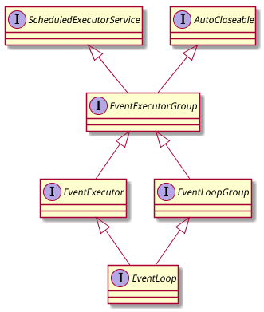

EventLoopGroup/EventLoop的关系和EventExecutorGroup/EventExecutor的关系非常类似, 都是费解的聚合+继承, 另外EventLoopGroup/EventLoop分别继承自EventExecutorGroup/EventExecutor.



# EventLoopGroup

EventLoopGroup是一个特殊的容许注册Channel的EventExecutorGroup.

## 接口定义

注意package 移到io.netty.channel了:

```java
package io.netty.channel;

public interface EventLoopGroup extends EventExecutorGroup {
}
```

## 覆盖EventExecutorGroup的方法

```java
    @Override
    EventLoop next();	// 返回类型从EventExecutor变成了EventLoop
```
## register()方法

这个是EventLoopGroup的核心, 用来注册Channel.

```java
    /**
     * 将Channel注册到EventLoopGroup中的一个EventLoop.
     * 当注册完成时,返回的ChannelFuture会得到通知.
     */
    ChannelFuture register(Channel channel);

    /**
     * 将Channel注册到EventLoopGroup中的一个EventLoop,
     * 当注册完成时ChannelPromise会得到通知, 而返回的ChannelFuture就是传入的ChannelPromise.
     */
    ChannelFuture register(Channel channel, ChannelPromise promise);
```

javadoc中有个注意的提醒: 只有当ChannelPromise成功后, 从ChannelHandler提交新任务到EventLoop中才是安全的, 否则这个任务可能被拒绝. 这个好理解, 只有Channel注册成功之后, 才能开始提交任务.


# EventLoop

## 接口定义

EventLoop的接口定义如下, 继承自EventExecutor/EventLoopGroup:

```java
public interface EventLoop extends EventExecutor, EventLoopGroup {
}
```

坦白说第一次看EventLoop的接口定义时, 看懵了, 完全不能理解netty为什么要这么设计 :)

现在分析完成EventExecutor/EventExecutorGroup的关系,再对照下面这个图, 总算能理解了.


## 覆盖基类方法

parent()方法和unwrap()被覆盖, 依然开始返回类型被修订为符合EventLoop的具体类型:

```java
@Override
EventLoopGroup parent();		// 返回所属的EventLoopGroup

@Override
EventLoop unwrap();			// unwrap出来的当然时EventLoop
```

## asInvoker()方法

不是太理解这个方法用来干嘛的, 后续继续看.

```java
/**
 * 创建一个新的默认 ChannelHandlerInvoker 实现, 使用当前EventLoop来调用事件处理方法.
 */
ChannelHandlerInvoker asInvoker();
```

## 额外说明

EventLoop最重要的方法是register()方法, 但是注意这个方法是在EventLoopGroup中定义.
